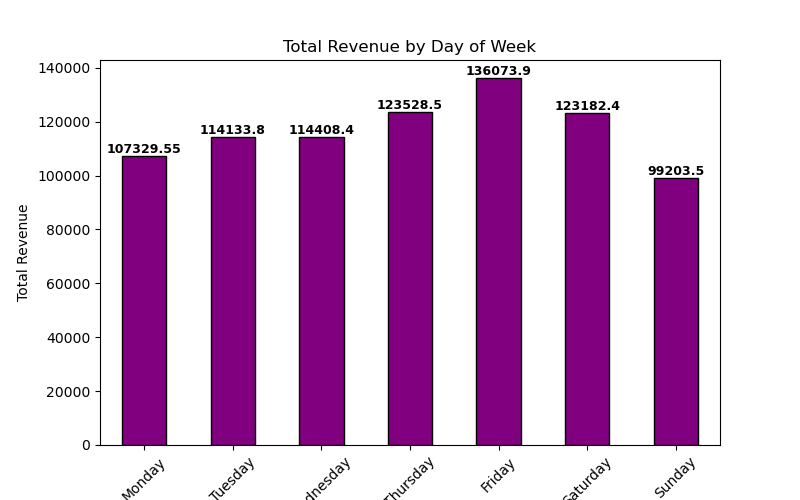
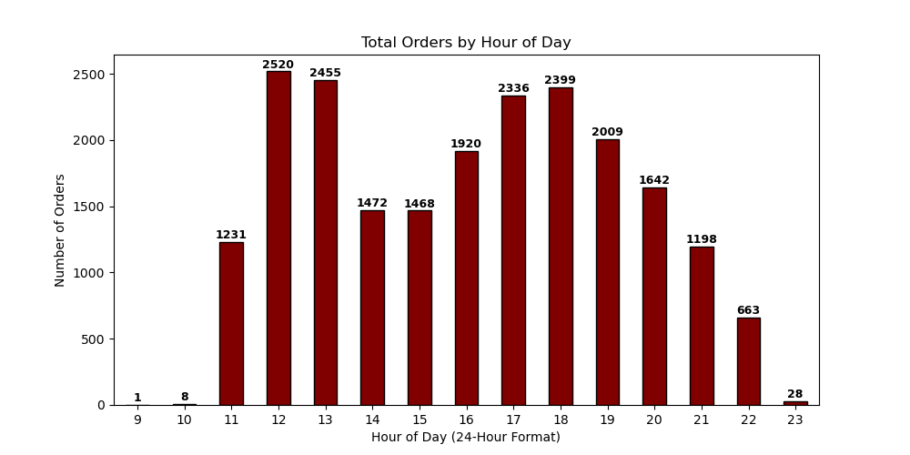
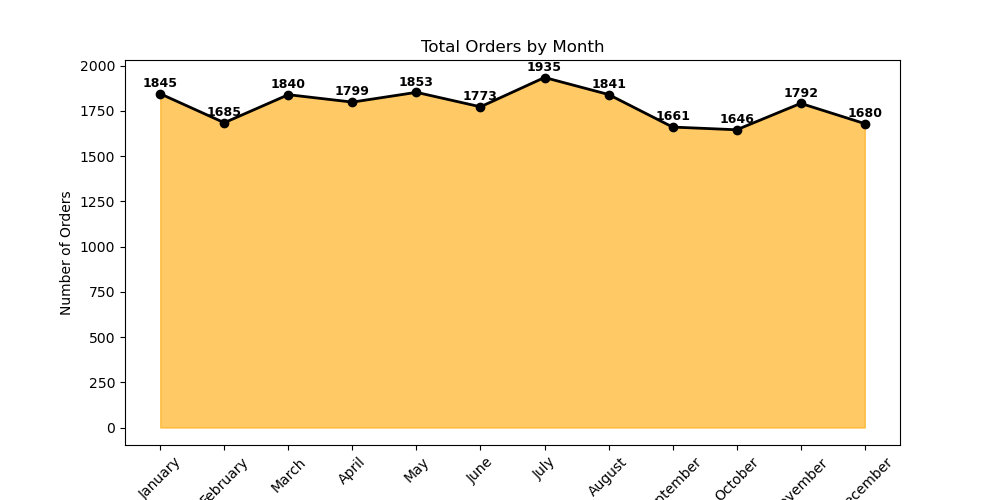
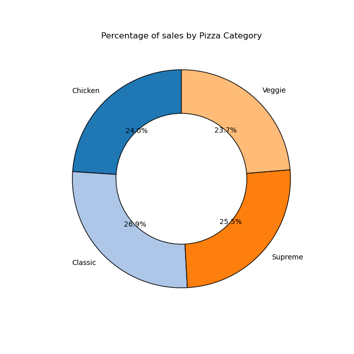
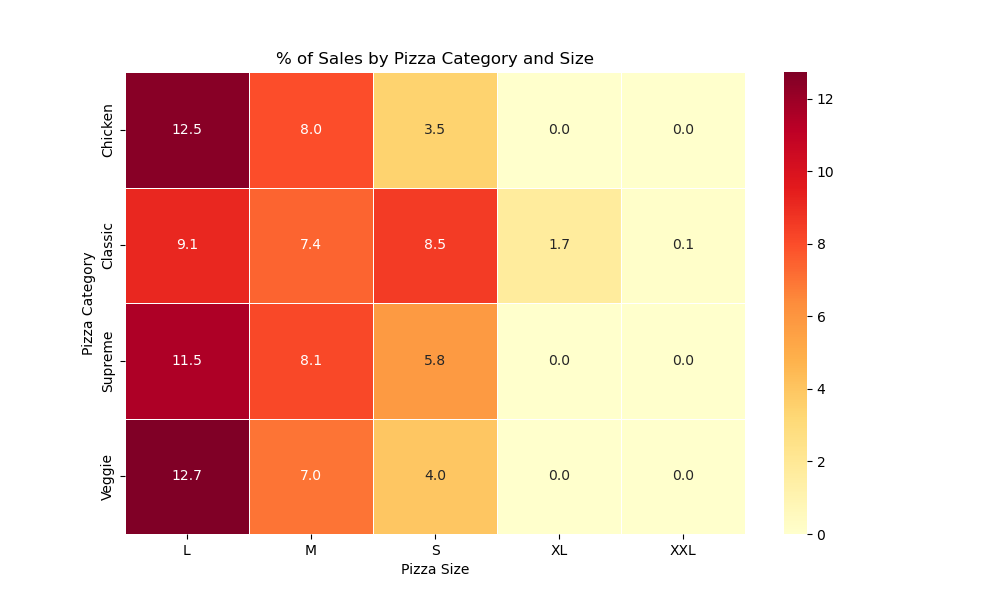
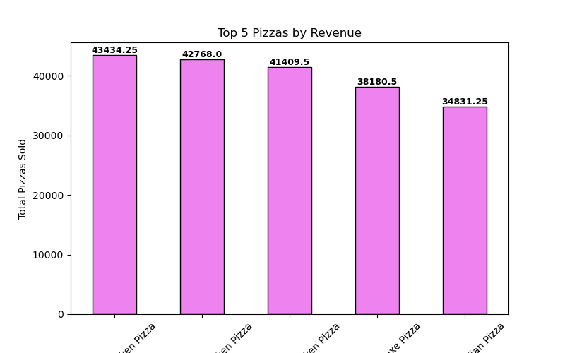
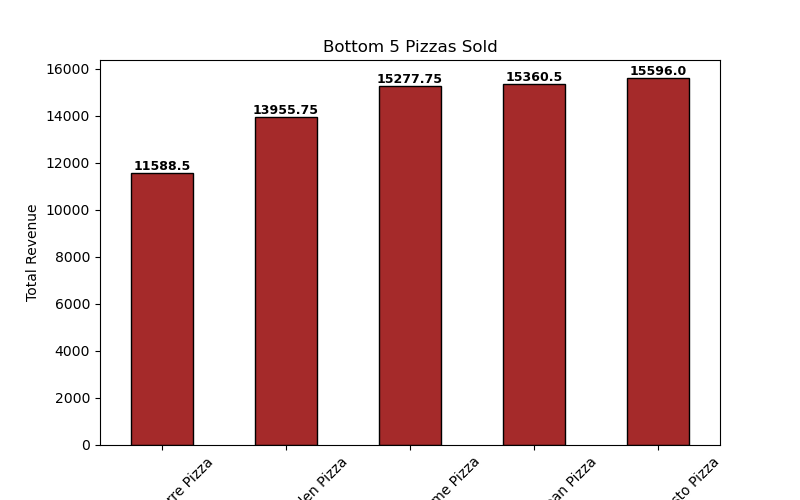

# 🍕 Pizza Sales Analysis Dashboard  

### 🧾 Project Overview  
An end-to-end **Pizza Sales Data Analysis** project designed to explore sales trends, performance metrics, and customer insights using **Python** and visualization libraries.  
This project helps business owners understand **which pizzas sell best, when sales peak, and how to improve operations**.

---

## 🎯 Business Objectives  
✅ Identify total **revenue, orders, and pizzas sold**  
✅ Analyze **sales by category, size, and type**  
✅ Study **daily, monthly, and hourly sales trends**  
✅ Find **top and bottom-performing pizzas**  
✅ Calculate **KPIs like Average Order Value (AOV)** and **Average Pizzas per Order**  

---

## 📊 Dataset  
**File:** `pizza_sales.csv`  

| Field | Description |
|:------|:-------------|
| order_id | Unique order identifier |
| pizza_id | Unique pizza identifier |
| pizza_name | Name of the pizza sold |
| quantity | Number of pizzas sold |
| total_price | Total sale amount |
| date / time | Timestamp of order |
| pizza_category | Pizza type (Classic, Supreme, etc.) |
| pizza_size | Pizza size (S, M, L, XL) |

---

## ⚙️ KPIs Calculated  
📌 **Total Revenue** = Σ total_price  
📌 **Total Pizzas Sold** = Σ quantity  
📌 **Total Orders** = Count(order_id)  
📌 **Average Order Value (AOV)** = Revenue ÷ Orders  
📌 **Average Pizzas per Order** = Pizzas ÷ Orders  

---

## 📈 Visual Insights  

### 🗓️ 1️⃣ Daily Sales Trend  
Shows which day has the highest sales.  
  

---

### ⏰ 2️⃣ Hourly Sales Trend  
Identifies the busiest hours for pizza orders.  
  

---

### 📅 3️⃣ Monthly Revenue Trend  
Reveals seasonal or campaign-driven spikes in sales.  
  

---

### 🍕 4️⃣ % Sales by Category  
Compares Classic, Supreme, Veggie & Chicken categories.  
  

---

### 📏 5️⃣ % Sales by Pizza Size  
Highlights the most popular pizza sizes.  
  

---

### ⭐ 6️⃣ Top 5 Best-Selling Pizzas  
Helps identify customer favorites for promotions.  
  

---

### ⚠️ 7️⃣ Bottom 5 Least-Selling Pizzas  
Shows pizzas that may need marketing or removal.  
  

---

## 💡 Business Questions Answered  
❓ What’s the total revenue and total pizzas sold?  
❓ Which categories and sizes perform best?  
❓ What are the busiest days and hours?  
❓ Which pizzas sell the most or least?  
❓ How can sales be improved through data insights?  

---

## 🧠 Insights & Recommendations  
🔹 Focus marketing on high-performing pizzas  
🔹 Improve or discontinue low-performing items  
🔹 Plan staffing & inventory using sales peaks  
🔹 Regularly monitor KPIs via dashboards  

---

## 🛠️ Tools & Technologies  
- **Python**: Pandas, NumPy, Matplotlib, Seaborn  
- **Jupyter Notebook**  
- **CSV Dataset (pizza_sales.csv)**  
- **GitHub** for portfolio hosting  

---

## 👩‍💻 Author  
**Jyoti Gupta**  
📍 Greater Noida, India  
📧 [guptajyoti10898@gmail.com](mailto:guptajyoti10898@gmail.com)  
🔗 [LinkedIn](https://www.linkedin.com/in/jyoti-gupta--) | [GitHub](https://github.com/jyotigupta17998)  

---

✨ *This project is part of my Data Analytics portfolio, demonstrating my ability to clean, analyze, and visualize real-world business data using Python.*  
